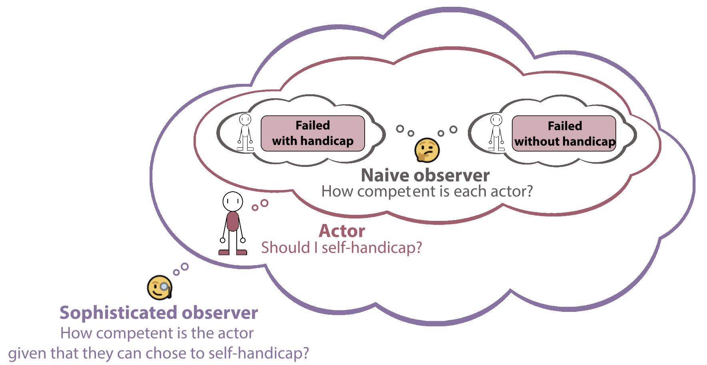

# A signaling theory of self-handicapping
Code and data for: Xiang, Y., Gershman, S.J., & Gerstenberg, T. (2024). A signaling theory of self-handicapping.

People use various strategies to bolster the perception of their competence. One strategy is
<i>self-handicapping</i>, by which people deliberately impede their performance in order to protect or
enhance perceived competence. Despite much prior research, it is unclear why, when, and how
self-handicapping occurs. We develop a formal theory that chooses the optimal degree of self-
handicapping based on its anticipated performance and signaling effects. We test the theory’s
predictions in two experiments (𝑁 = 400), showing that self-handicapping occurs more often
when it is unlikely to affect the outcome and when it increases the perceived competence in the
eyes of a naive observer. With sophisticated observers (who consider whether a person chooses
to self-handicap), self-handicapping is less effective when followed by failure. We show that the
theory also explains the findings of several past studies. By offering a systematic explanation
of self-handicapping, the theory lays the groundwork for developing effective interventions.

Experiment 1: https://gershmanlab.com/experiments/yang/hidden_genius/exp1final.html

Experiment 2: https://gershmanlab.com/experiments/yang/hidden_genius/exp2final.html

(The links may take about 5 seconds to load)

Preregistration: https://aspredicted.org/f4h3-f4xv.pdf

In the `Code` folder, `model_fitting.R` outputs the fitted parameter values (`fitted_params.csv`). `simulation.R` then uses these values to generate model predictions (`model_prediction.csv`). `plot_figures.R` uses data under the Data folder and model predictions to plot figures. `helper.R` contains helper functions for plotting. `regression.R` contains Bayesian mixed-effects models. 

In the `Data` folder, `data.csv` contains data from both experiments. The `accuracy` and `probability_10` (probability of choosing to be evaluated on 10 answers) columns are from the actor block. `observer`, `outcome`, and `evaluation` columns are from the naive and sophisticated observer blocks.

Our experiments used JavaScript library jsPsych v7.3.4, which can be downloaded from here: [https://github.com/jspsych/jsPsych/releases](https://github.com/jspsych/jsPsych/releases/tag/jspsych%407.3.4). In the `Experiment` folder, `exp1.html` and `exp2.html` are the html files for Experiment 1 and Experiment 2 (without the consent form). 
`plugin-html-slider-response.js` (shows four sliders at once) and `plugin-survey-multi-choice.js` (adds figure to the left of the multi-choice questions) were modified plugins for the purposes of our experiments. `save_data.php` is used to write data to server.
